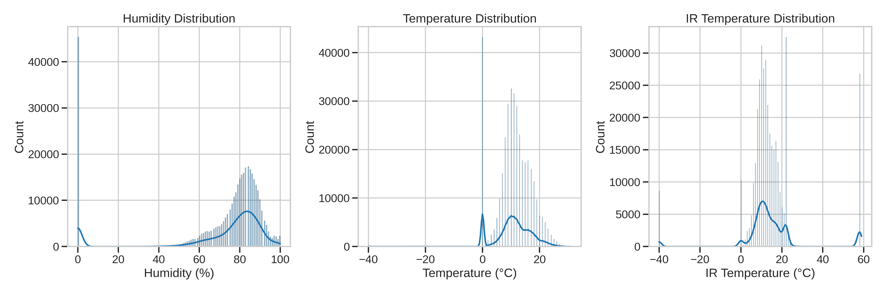
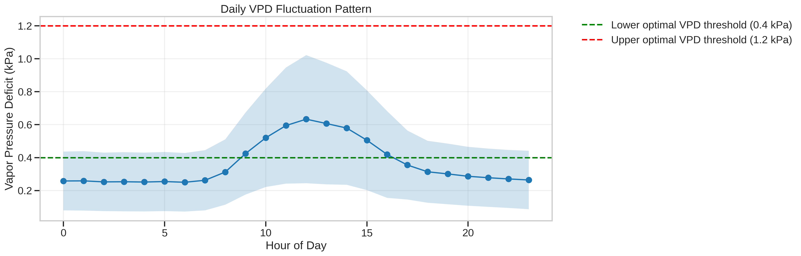
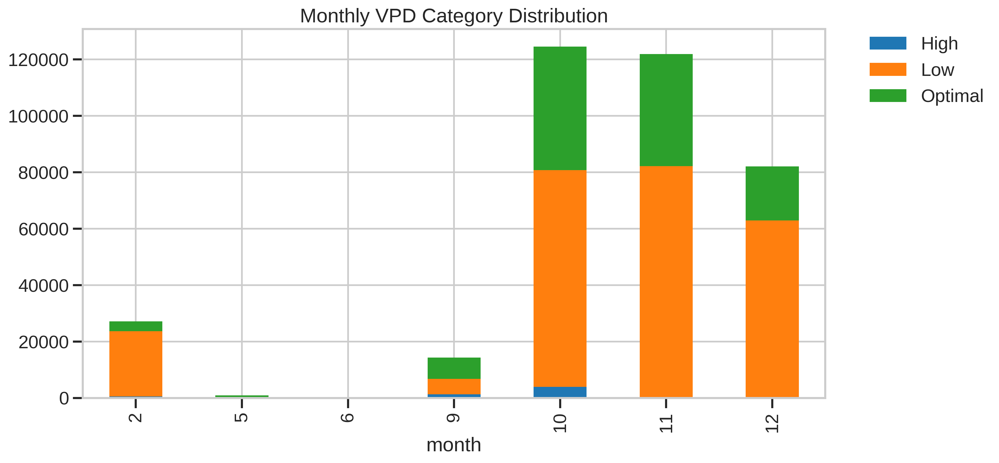
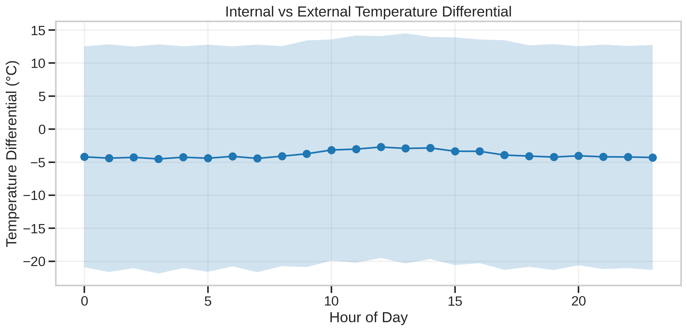
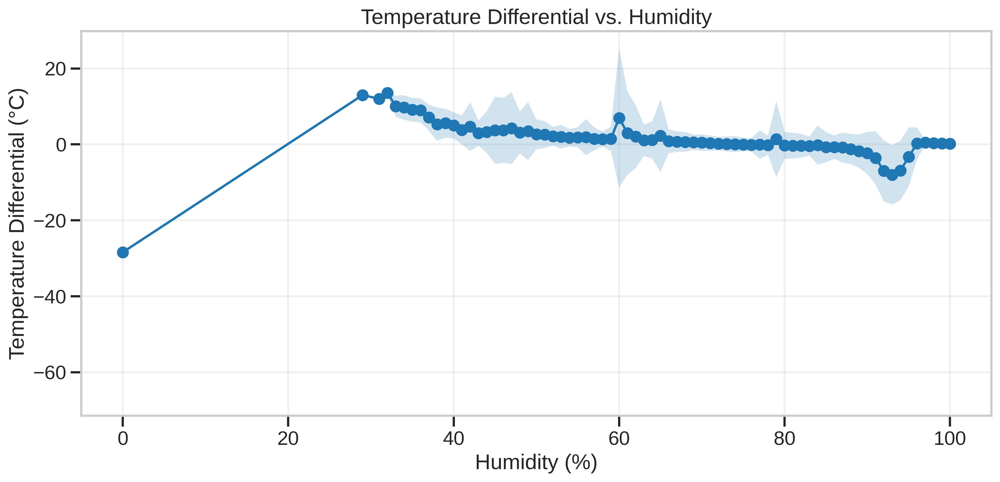
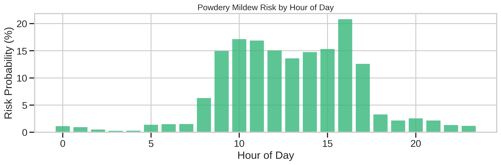
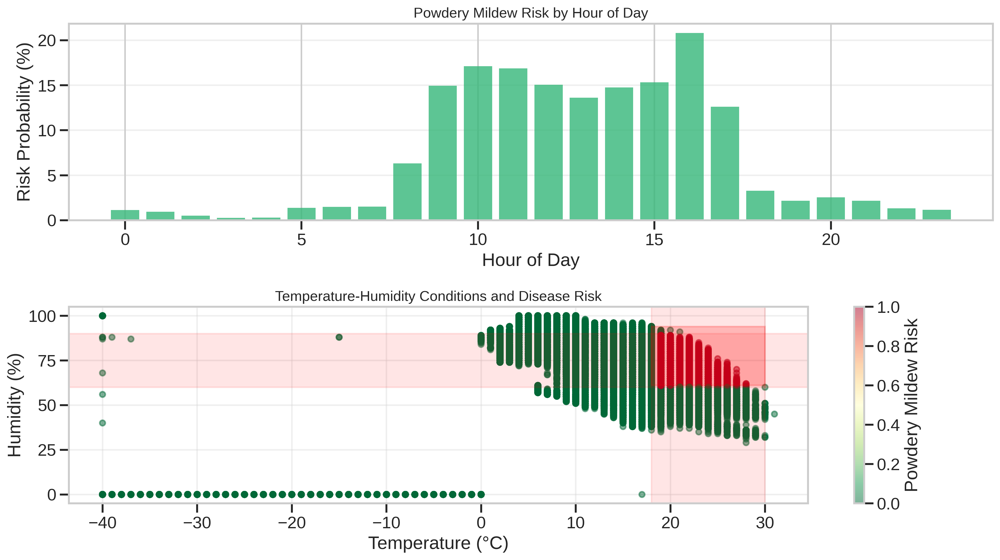

# 🍓 Optimising Greenhouse Conditions: Strawberry Cultivation EDA

Environmental sensor data doesn't just tell you what's happening inside a greenhouse — it tells you whether your strawberries are happy. This project analyses **371,079 sensor readings** from a strawberry greenhouse in the Chichester area, using data visualisation and domain knowledge to answer three practical questions for growers.

---

## 📁 Dataset overview

**File:** `Strawberry_Greenhouse.csv`

| Feature | Description |
|---|---|
| `deviceId` | Identifies individual sensor units across 14 locations |
| `humidity` | Relative humidity (%) |
| `temperature` | Ambient air temperature (°C) |
| `irTemperature` | Infrared leaf surface temperature (°C) |
| `timestamp` | Date and time of reading |

Two derived features were engineered for the analysis:
- **VPD (Vapour Pressure Deficit)** — calculated from temperature and humidity to measure plant transpiration stress
- **temp_diff** — the difference between air and leaf surface temperature, used as an indicator of plant water stress

---

## 📊 Exploratory Data Analysis



Humidity averaged **70.2%**, comfortably within the ideal 60–80% range for strawberries. Temperature readings mostly fell between 8°C and 15°C, with infrared temperature showing higher variability (std 8.9°C), reflecting direct solar exposure on leaf surfaces.

| Relationship | Correlation | What it means |
|---|---|---|
| Humidity & Temperature | +0.52 | Warmer air holds more moisture |
| Humidity & IR Temperature | -0.31 | Higher humidity cools leaf surfaces |
| Temperature & IR Temperature | -0.037 | Leaf temp driven by solar exposure, not air |

---

## 🔍 Research questions

### RQ1 — How do VPD levels fluctuate throughout the day, and how often are conditions optimal for strawberry growth?

Optimal VPD for strawberries sits between **0.4 – 1.25 kPa**. The greenhouse achieved this only **30.93%** of the time overall, but during peak daylight hours (9:00 AM – 4:00 PM) this rose to nearly **60.69%** at midday. Nighttime hours consistently fell below the optimal range, suggesting humidity reduction at night could meaningfully improve growing conditions.

Seasonally, **October and November** provided the most suitable growing environment, while winter months (December – February) showed the highest proportion of low VPD periods due to suppressed vapour pressure in cooler temperatures.




---

### RQ2 — What do temperature differentials between air and plant surfaces reveal about water stress and energy demand?

On average, plant surfaces were **1.5°C cooler** than the surrounding air — a healthy sign indicating active transpiration. This differential peaked at **2.5°C – 2.8°C** during midday (11:00 AM – 2:00 PM), when photosynthesis is most active.

The relationship between temperature differential and humidity was notably non-linear: at very low humidity (below 20%), the differential dropped sharply to around -30°C, indicating aggressive dehumidification. From 30–100% humidity, the system settled into a balanced heating/cooling strategy.




---

### RQ3 — How often do conditions fall within the risk threshold for powdery mildew?

Powdery mildew in strawberries is a widespread fungal disease caused by the pathogen Podosphaera aphanis. It creates a fine, white, dusty coating on leaves, flowers, and fruit, ultimately stoping plant growth, reducing photosynthesis, and ruining crop yields.
It thrives at **18°C–30°C** combined with **60–90% relative humidity** and can cause yield losses of up to **70%**. Risk analysis revealed:

- **Minimal risk** during early morning (midnight – 7:00 AM) and late evening, with probability below 3%
- **Risk escalates** from 8:00 AM, peaking at **20–22% probability** around 4:00 PM
- Targeted adjustments between **10:00 AM – 4:00 PM** — reducing temperature below 20°C or humidity below 60% — could significantly reduce disease pressure




---

## 📊 Key findings

- Greenhouse humidity averaged 70.2%, comfortably within the ideal 60–80% range for strawberries
- Temperature and humidity showed a moderate positive correlation (0.52) — warmer air holds more moisture
- Humidity and infrared temperature showed a weak negative correlation (-0.31) — higher humidity cools leaf surfaces
- Air temperature and leaf surface temperature were nearly uncorrelated (-0.037), suggesting leaf temperature is driven more by direct solar exposure than ambient air

## 🛠 Tools & libraries


---

## ▶️ How to Run

```bash
git clone https://github.com/Aarchi01/Strawberry-Greenhouse-EDA-Project
cd Strawberry-Greenhouse-EDA-Project
pip install pandas numpy matplotlib seaborn jupyter
jupyter notebook A00025390_Code_DataViz.ipynb
```
